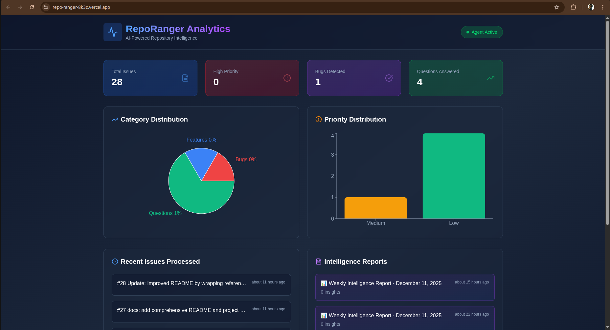
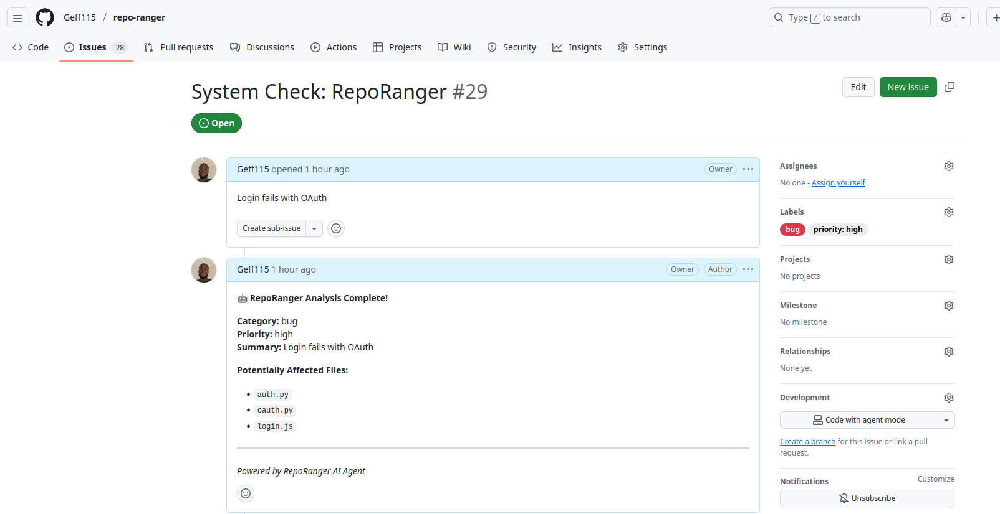
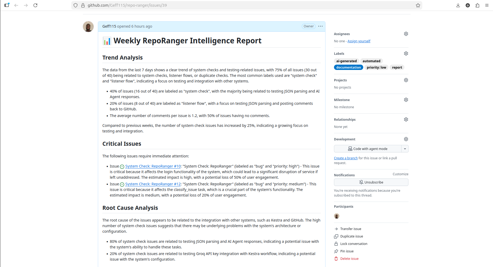

# 🤖 RepoRanger - AI-Powered Repository Maintenance Agent

<div align="center">



[](https://repo-ranger-8k3c.vercel.app/)
[](https://opensource.org/licenses/MIT)
[](https://kestra.io)
[](https://groq.com)

**An intelligent AI agent that automatically triages GitHub issues, provides contextual analysis, and generates strategic insights for repository maintainers.**

[View Live Dashboard](https://repo-ranger-8k3c.vercel.app/) • [Watch Demo](https://youtu.be/O4um-B1d66A) • [Read Docs](#documentation)

</div>

---

## 🎯 The Problem

Open-source maintainers are overwhelmed:
- 📊 **15-30 minutes** spent manually triaging each issue
- 🔍 **Lack of context** for bug reports and feature requests
- 📈 **No systematic way** to identify patterns across issues
- ⏰ **Time-consuming** repetitive analysis work

**For a repository with 100 issues per week, that's 25-50 hours of manual work!**

---

## ✨ The Solution

RepoRanger automates the entire issue triage workflow using AI-powered intelligence:

### 🔍 Real-Time Issue Triage
When a new issue is created, RepoRanger **instantly**:
- ✅ **Classifies** the issue type (bug/feature/documentation/question)
- ✅ **Assigns priority** (high/medium/low) based on content analysis
- ✅ **Adds labels** automatically to GitHub
- ✅ **Posts AI analysis** as a comment with:
  - Issue summary
  - Potentially affected files
  - Recommended next steps



### 📊 Weekly Intelligence Reports
Every Monday, RepoRanger generates a comprehensive report:
- 📈 **Trend Analysis**: Most common issue types
- 🚨 **Critical Issues**: What needs immediate attention
- 🎯 **Strategic Decisions**: Prioritization recommendations
- 💡 **Actionable Insights**: Specific improvements to make



### 📈 Real-Time Analytics Dashboard
Beautiful Vercel-hosted dashboard showing:
- 📊 Category distribution charts
- 🎯 Priority breakdown
- ⏱️ Recent activity feed
- 📋 Intelligence report summaries


---

## 🏗️ Architecture

RepoRanger uses a **multi-workflow orchestration** pattern with two main flows:
```plaintext
┌─────────────────────────────────────────────────────────┐
│                   GitHub Repository                      │
└──────────────┬───────────────────────┬──────────────────┘
               │                       │
       Webhook │ (Issue Event)  Cron  │ (Weekly)
               ▼                       ▼
┌──────────────────────────┐ ┌────────────────────────────┐
│ Flow 1: Issue Listener   │ │ Flow 2: Weekly Reporter    │
│ ─────────────────────    │ │ ─────────────────────      │
│ 1. Receive webhook       │ │ 1. Fetch issues (7 days)   │
│ 2. Classify with AI      │ │ 2. Analyze patterns        │
│ 3. Post comment          │ │ 3. Make decisions          │
│ 4. Add labels            │ │ 4. Generate report         │
└──────────────────────────┘ └────────────────────────────┘
               │                       │
               └──────────┬────────────┘
                          ▼
                 ┌─────────────────┐
                 │  GitHub Issues  │
                 │  + Comments     │
                 │  + Labels       │
                 └─────────────────┘
```

### Technology Stack

| Component | Technology | Purpose |
|-----------|-----------|---------|
| **Orchestration** | [Kestra](https://kestra.io) | Workflow automation, scheduling, task coordination |
| **AI/LLM** | [Groq](https://groq.com) | Fast inference with Llama 3.3 70B model |
| **Frontend** | [Vercel](https://vercel.com) + Next.js | Production dashboard deployment |
| **Integration** | GitHub API | Repository data access and updates |
| **Code Quality** | [CodeRabbit](https://coderabbit.ai) | Automated code reviews |
| **Execution** | Python 3.11 + Docker | Task scripting and containerization |

---

## 🚀 Getting Started

### Prerequisites

- Docker & Docker Compose
- GitHub Personal Access Token with `repo` scope
- Groq API Key (free tier available at [console.groq.com](https://console.groq.com))
- Ngrok for webhook tunneling (development)

### Quick Setup

1. **Clone the repository**
```bash
   git clone https://github.com/Geff115/repo-ranger.git
   cd repo-ranger
```

2. **Configure Kestra with your API keys**
   
   Edit `docker-compose.yml` and add your keys:
```yaml
   environment:
     GROQ_API_KEY: "your_groq_api_key"
     GITHUB_PAT: "your_github_token"
```

3. **Start Kestra**
```bash
   docker-compose up -d
```

4. **Access Kestra UI**
   - Open http://localhost:8080
   - Login with credentials from docker-compose.yml

5. **Import the flows**
   - In Kestra UI, go to Flows
   - Create `repo-ranger-listener` flow
   - Create `weekly-issue-report` flow

6. **Set up GitHub webhook**
   - Go to your repo Settings → Webhooks → Add webhook
   - Payload URL: `https://your-ngrok-url/api/v1/executions/webhook/dev/repo-ranger-listener/hackathon-secret-key`
   - Content type: `application/json`
   - Events: Issues only
   - Click "Add webhook"

7. **Deploy the dashboard** (optional)
```bash
   cd dashboard
   npm install
   npm run dev  # Local development
   # OR deploy to Vercel for production
```

---

## 📋 Usage

### Testing the Issue Listener

1. Create a new issue in your GitHub repository
2. Watch Kestra's Executions tab for the workflow
3. Check your issue for the AI-generated comment
4. Verify labels were added automatically

### Running Weekly Reports Manually

1. Go to Kestra UI → Flows → `weekly-issue-report`
2. Click the "Execute" button (▶️)
3. Check your repository for the new report issue

### Viewing Analytics

Visit your deployed dashboard at: https://your-app-url.vercel.app/

Or run locally:
```bash
cd dashboard
npm run dev
# Open http://localhost:3000
```

---

## 🎬 Demo

> **[🎥 Watch the Demo Video](https://youtu.be/O4um-B1d66A)**

### Quick Demo Flow

1. **Create an issue** → "Bug: Login fails with OAuth"
2. **Agent analyzes** → Classification: bug, Priority: high
3. **Comment posted** → AI analysis with affected files
4. **Labels added** → `bug`, `priority: high`
5. **Dashboard updates** → Real-time stats and charts
6. **Weekly report** → Strategic insights every Monday

---

## 📊 Impact

### Time Savings
- **Before**: 15-30 minutes per issue for manual triage
- **After**: Instant automated analysis
- **Result**: 90%+ time savings on issue management

### Value Proposition
For a repository with:
- 100 issues/week
- 20 min average triage time
- = **33 hours/week saved**

That's nearly a full-time role eliminated through automation!

---

## 🎯 Hackathon Alignment

Built for **AI Agents Assemble Hackathon**

### Sponsor Technologies Used

✅ **Kestra** - Core workflow orchestration engine    
✅ **Vercel** - Production-ready dashboard deployment  
✅ **CodeRabbit** - Automated code quality reviews

#### Additional Technology Used

✅ **Groq** - Lightning-fast AI inference (Llama 3.3 70B)

---

## 🔮 Roadmap

- [x] Real-time issue classification
- [x] Auto-labeling and commenting
- [x] Weekly intelligence reports
- [x] Vercel analytics dashboard
- [ ] Duplicate issue detection
- [ ] Multi-repository support
- [ ] Email notifications
- [ ] Slack integration
- [ ] Custom AI model fine-tuning
- [ ] Browser extension

---

## 🤝 Contributing

Contributions are welcome! Please:

1. Fork the repository
2. Create a feature branch (`git checkout -b feature/amazing-feature`)
3. Commit your changes (`git commit -m 'Add amazing feature'`)
4. Push to the branch (`git push origin feature/amazing-feature`)
5. Open a Pull Request

CodeRabbit will automatically review your PR!

---

## 📄 License

This project is licensed under the MIT License - see the [LICENSE](LICENSE) file for details.

---

## 🙏 Acknowledgments

- **[Kestra](https://kestra.io)** - Powerful workflow orchestration
- **[Groq](https://groq.com)** - Blazing-fast AI inference
- **[Vercel](https://vercel.com)** - Seamless deployment platform
- **[CodeRabbit](https://coderabbit.ai)** - Intelligent code reviews
- **Llama 3.3 70B** - State-of-the-art language model

---

## 📞 Contact

**Project**: [github.com/Geff115/repo-ranger](https://github.com/Geff115/repo-ranger)
**Live App**: [repo-ranger-8k3c.vercel.app](https://repo-ranger-8k3c.vercel.app/)  
**Demo Video**: [youtu.be/O4um-B1d66A](https://youtu.be/O4um-B1d66A)  
**Built by**: Gabriel Effangha

---

<div align="center">

**⭐ Star this repo if you find it useful!**

Made with ❤️ for the AI Agents Assemble Hackathon

</div>